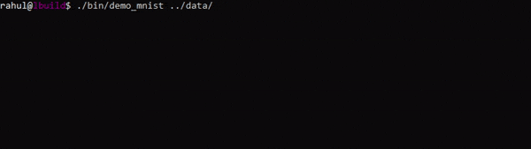
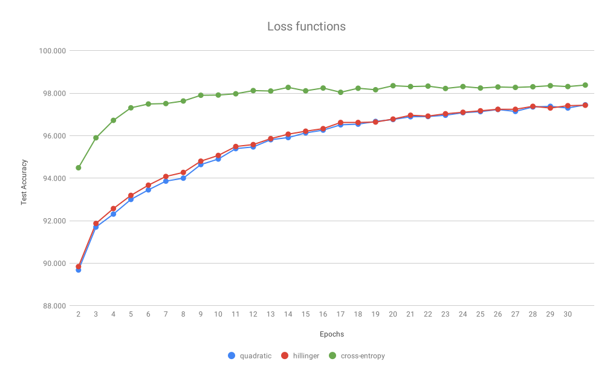
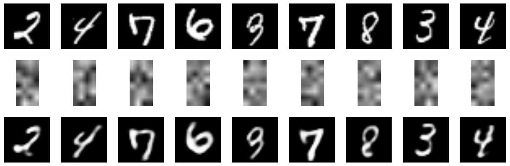

Simple Neural Network Library (v2 alpha)
========================================

This project is my attempt to create a simple neural network
code in C++ (cpp17) that is powerful enough to give decent
results in [MNIST dataset](http://yann.lecun.com/exdb/mnist/).
You can download the dataset manually or run [download_mnist.py](scripts/download_mnist.py).

The project is inspired by the simplicity of Keras. Creating a network for MNIST.

Code snippet:
```cpp
    models::sequential m;
    m.add("dense(units=300, input=784)");
    m.add("dense(units=10)");
    m.compile("loss=cross_entropy(), optimizer=sgd(learning_rate=0.5)");
    m.summary();
```

Console Output:



See [demo_mnist.cpp](examples/demo_mnist.cpp) for full code.

---

*	[Features](#features)
*	[Results](#results)
*	[Project structure](#project-structure)
*   [Building Project](#building-project)

---

[](#features)
## Currently Supported Features

### 1. Save/Load Models
*   Sequential
*   Autoencoder

### 2. Layers
*	Dense Layer
*   Dropout Layer
*   Flatten Layer

### 3. Activators
*	Sigmoid
*	Tanh
*	Relu

### 4. Loss Functions
*	Quadratic
*	Hillinger
*	Cross-entropy

### 5. Variable Initializers
*	Zeros
*	Normal
*	Xavier

### 6. Optimizers
*	SGD
*   Momentum
*   RMSProp
*   AdaGrad
*   Adam

---

[](#results)
## Results

Experiment:
* Dataset: MNIST
* Hidden Layers: 1 Dense Layer (300 neurons)
* Learning Rate: 0.5 (Decay = 0)
* Batch Size: 32

See [demo_mnist.cpp](examples/demo_mnist.cpp) for full code.

Here is a comparision of different Loss-Functions (test-accuracy)


Autoencoder Experiment:
* Dataset: MNIST
* Autoencoder (784->256->32, 32->256->784)
* Cross-entropy with Adam(learning_rate=0.001)
* Batch Size: 32

See [autoencoder_mnist.cpp](examples/autoencoder_mnist.cpp) for full code.

Here is a reconstruction of some random examples.


---

[](#project-structure)
add soon...

---

[](#building-project)
## Building Project

### Building examples

```sh
git clone https://github.com/rahulsrma26/simpleNN.git
cd simpleNN
mkdir build
cd build
```

* Linux and MacOS (make)
    ```sh
    cmake ..
    make
    ```

* Windows

    Visual Studio 2017 and later can directly open a CMake project. However, if you want to build using Developer Command prompt and have [cmake](https://cmake.org/) installed then run:
    ```sh
    cmake ..
    msbuild simpleNN.sln /t:Build /p:Configuration=Release
    ```

### Running examples

```sh
# After build first download MNIST dataset
python ../scripts/download_mnist.py ../data/mnist
# or you can download fashion mnist
# python ../scripts/download_fashion.py ../data/fashion
# mnist example
bin/demo_mnist ../data/mnist
# spiral example
bin/spiral_test
# mnist model with save/restore
bin/mnist_model ../data/mnist
```
For windows users that are using MSVC check '.exe' files in bin\Release folder.

### Even More ways to build

You can also be build using [ninja](https://ninja-build.org/) across any platform.

* Using ninja
    ```sh
    cmake .. -GNinja
    ninja -v
    ```

* If you want to use mingw (GCC) instead of MSVC under windows then [chocolatey](https://chocolatey.org/) can be used to install dependencies for ninja build.

    ```sh
    choco intall -y mingw ninja cmake
    ```
    After that append cmake install path ("C:\Program Files\CMake\bin") to [Environment Variable](https://helpdeskgeek.com/windows-10/add-windows-path-environment-variable/).

