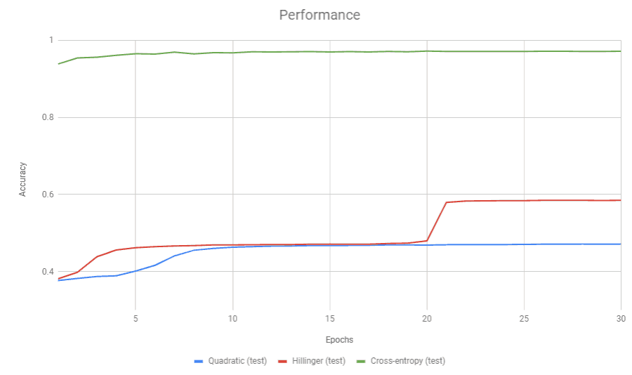
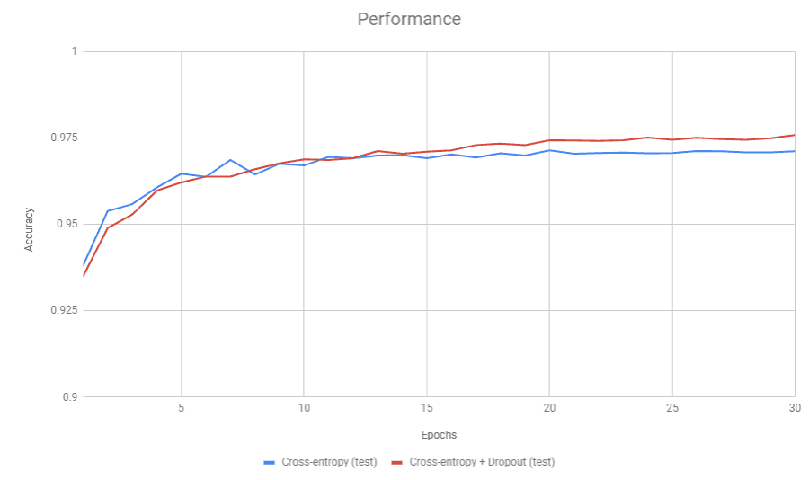

Simple Neural Network Library
=============================

This project is my attempt to create a simple neural network
code in C++ (cpp17) that is powerful enough to give decent
results in [MNIST dataset](http://yann.lecun.com/exdb/mnist/).
You can download the dataset manually or run [download_mnist.py](download_mnist.py).

*	[Features](#features)
*	[Results](#results)
*	[Project structure](#project-structure)
*   [Building Project](#build-project)

---

[](#features)
## Supported Features

### Layers
*	Dense Layer
*	Dropout Layer

### Activators
*	sigmoid
*	tanh
*	relu
*	leaky-relu

### Loss Functions
*	quadratic
*	hillinger
*	cross-entropy

---

[](#results)
## Results

The project is inspired by Keras. So, I tried to keep it very simple. Creating a network for MNIST.
```cpp
    NeuralNetwork nn(784, loss::crossEntropy);
    nn.add(make_unique<DenseLayer>(400));
    nn.add(make_unique<Dropout>(0.3f));
    nn.add(make_unique<DenseLayer>(10));
```
see [mnist.cpp](examples/mnist.cpp) for full code.

Experiment:
* Dataset: MNIST
* Hidden Layers: 1 Dense Layer (400 neurons, no dropout)
* Learning Rate: 0.3 (decreased by 3% every epoch)

Here is a comparision of different Loss-Functions (test-accuracy)


After using a dropout of 30%.


---

[](#project-structure)
## Project Structure
*	__nntypes.h__  
	Defines basic types used in the library.

*	__activators.h__  
    Different Activators supported by library.

*	__lossFunctions.h__  
    Different Loss Functions supported by library.

*	__NNLayer.h__  
    Parent class for all layer types.

*	__DenseLayer.h__  
    Uses: DenseLayer(numNeurons, activator=activator::sigmoid)

*	__Dropout.h__  
    Uses: Dropout(dropoutProbability)

*	__NeuralNetwork.h__  
    Uses: NeuralNetwork(inputNeurons, cost=loss::quadratic)

*	__simpleNN.h__  
    Include Header (wrapper for Simple Neural Network Library).

---

[](#project-structure)
## Building Project

### Building examples

Examples can be build using [cmake](https://cmake.org/).

* Linux and MacOS (make)
    ```sh
    mkdir build
    cd build
    cmake ..
    make
    ```

* Windows

    Visual Studio 2017 and later can directly open a CMake project. However, if you want to build using Developer Command prompt and have [cmake](https://cmake.org/) installed then run:
    ```sh
    mkdir build
    cd build
    cmake ..
    msbuild simpleNN.sln /t:Build /p:Configuration=Release
    ```
---

### Running examples

```sh
# download MNIST dataset
python download_mnist.py
# mnist example
bin/mnist ../data
# spiral example
bin/spiral
```
For windows users that are using MSVC check .exe files in bin\Release folder.

## Even More ways to build

You can also be build using [ninja](https://ninja-build.org/) across any platform.

* Using ninja
    ```sh
    mkdir build
    cd build
    cmake .. -GNinja
    ninja -v
    ```

* If you want to use mingw (GCC) instead of MSVC under windows then [chocolatey](https://chocolatey.org/) can be used to install dependencies for ninja build.

    ```sh
    choco intall -y mingw ninja cmake
    ```
    After that append cmake install path ("C:\Program Files\CMake\bin") to [Environment Variable](https://helpdeskgeek.com/windows-10/add-windows-path-environment-variable/).

