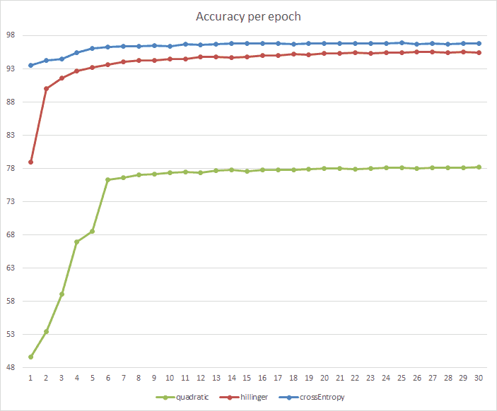
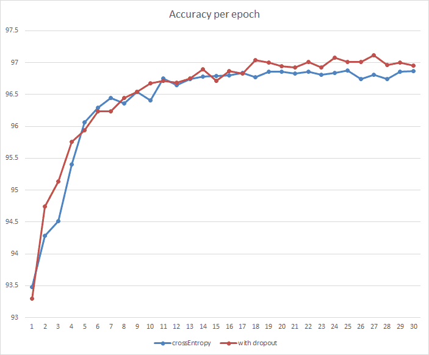

Simple Neural Network Library
=============================

This project is my attempt to create a simple neural network
code in c++ (cpp17) that is powerful enough to give decent 
results in [MNIST dataset](http://yann.lecun.com/exdb/mnist/).

*	[Features](#features)
*	[Results](#results)
*	[Project structure](#project-structure)

---

## Supported Features

### Layers
*	Dense Layer
*	Dropout Layer

### Activators
*	sigmoid
*	tanh
*	relu
*	leaky-relu

### Loss Functions
*	quadratic
*	hillinger
*	cross-entropy

---

## Results
Experiment:
* Dataset: MNIST
* Hidden Layers: 1 Dense Layer (100 neurons)
* Learning Rate: 0.5 decreased by 4% every epoch

Here is a comparision of different Loss-Functions

---

## Project Structure
*	__nntypes.h__  
	Defines basic types for the library.

*	__nntypes.h__

__Misc__  
StdAfx.h, StdAfx.cpp  
    These files are used to build a precompiled header (PCH) file

